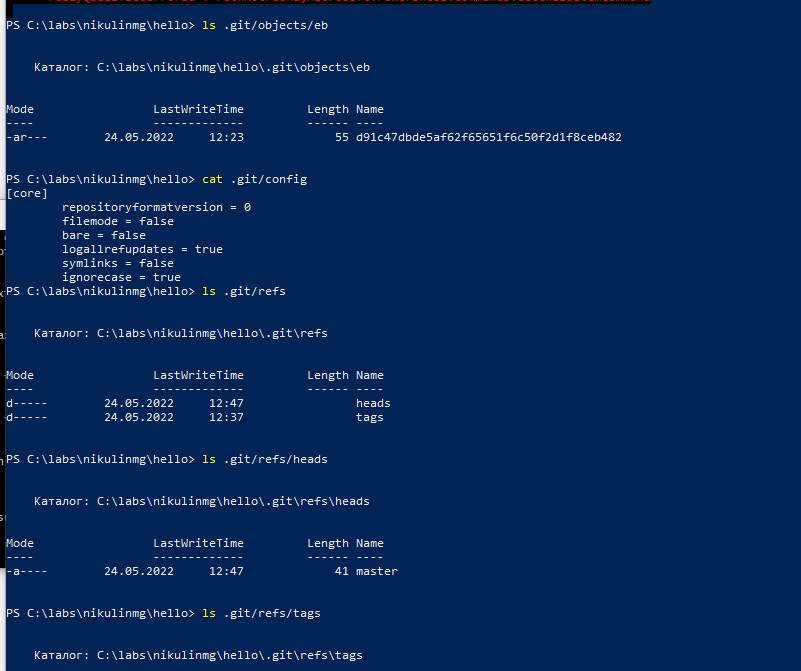
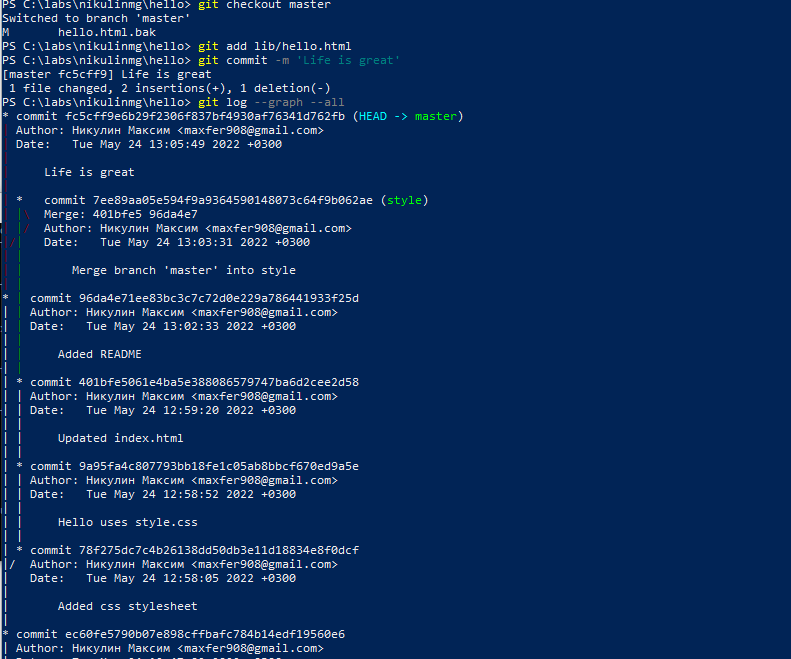

---
# Front matter
title: "Лабораторная работа №1"
subtitle: "Работа с git"
author: "Никулин Максим Геннадьевич"

# Generic otions
lang: ru-RU

# Pdf output format
toc_depth: 2
lof: false # List of figures
lot: false # List of tables
fontsize: 12pt
linestretch: 1.5
papersize: a4
documentclass: scrreprt
## I18n
polyglossia-lang:
  name: russian
  options:
	- spelling=modern
	- babelshorthands=true
polyglossia-otherlangs:
  name: english
### Fonts
mainfont: PT Serif
romanfont: PT Serif
sansfont: PT Sans
monofont: PT Mono
mainfontoptions: Ligatures=TeX
romanfontoptions: Ligatures=TeX
sansfontoptions: Ligatures=TeX,Scale=MatchLowercase
monofontoptions: Scale=MatchLowercase,Scale=0.9
## Biblatex
biblatex: true
biblio-style: "gost-numeric"
biblatexoptions:
  - parentracker=true
  - backend=biber
  - hyperref=auto
  - language=auto
  - autolang=other*
  - citestyle=gost-numeric
## Misc options
indent: true
header-includes:
  - \linepenalty=10 # the penalty added to the badness of each line within a paragraph (no associated penalty node) Increasing the value makes tex try to have fewer lines in the paragraph.
  - \interlinepenalty=0 # value of the penalty (node) added after each line of a paragraph.
  - \hyphenpenalty=50 # the penalty for line breaking at an automatically inserted hyphen
  - \exhyphenpenalty=50 # the penalty for line breaking at an explicit hyphen
  - \binoppenalty=700 # the penalty for breaking a line at a binary operator
  - \relpenalty=500 # the penalty for breaking a line at a relation
  - \clubpenalty=150 # extra penalty for breaking after first line of a paragraph
  - \widowpenalty=150 # extra penalty for breaking before last line of a paragraph
  - \displaywidowpenalty=50 # extra penalty for breaking before last line before a display math
  - \brokenpenalty=100 # extra penalty for page breaking after a hyphenated line
  - \predisplaypenalty=10000 # penalty for breaking before a display
  - \postdisplaypenalty=0 # penalty for breaking after a display
  - \floatingpenalty=20000 # penalty for splitting an insertion (can only be split footnote in standard LaTeX)
  - \raggedbottom # or \flushbottom
  - \usepackage{float} # keep figures where there are in the text
  - \floatplacement{figure}{H} # keep figures where there are in the text
---

## Цель работы

Научиться работать с системой контроля версий Git.

## Выполнение лабораторной работы

### 1.1 Подготовка

#### 1.1.1 Установка имени и электронной почты
```
git config --global user.name "Kristina Monastyrskaya"
git config --global user.email "kristinamonvol@gmail.com"
```

#### 1.1.2 Параметры установки окончаний строк

Для пользователей Windows:
```
git config --global core.autocrlf true
git config --global core.safecrlf true
```

#### 1.1.3 Установка отображения unicode
Что бы избежать нечитаемых строк,
установиkf соответствующий флаг.
```
git config --global core.quotepath off
```

### 1.2 Создание проекта

#### 1.2.1 Создайте страницу «Hello, World»

Начните работу в пустом рабочем каталоге с создания пустого каталога с именем
hello, затем войдите в него и создайте там файл с именем hello.html.
```
mkdir hello
cd hello
touch hello.html
echo "Hello, World!" > hello.html
```

#### 1.2.2 Создание репозитория
Чтобы создать git репозиторий из этого каталога, выполните команду git init.
```
git init
```

#### 1.2.3 Добавление файла в репозиторий
```
git add hello.html
git commit -m "Initial Commit"
```

#### 1.2.4 Проверка состояние репозитория
```
git status
```

Команда проверки состояния сообщит, что коммитить нечего. Это означает,
что в репозитории хранится текущее состояние рабочего каталога, и нет никаких
изменений, ожидающих записи. 

{#fig:001 width=80%}


### 1.3 Внесение изменений
#### 1.3.1 Изменила страницу «Hello, World»
Добавим кое-какие HTML-теги к нашему приветствию. Изменила содержимое
файла hello.html на:
``` html
<h1>Hello, World!</h1>
```

{#fig:001 width=80%}

Проверьте состояние рабочего каталога.
```
git status
```
git знает, что файл hello.html был изменен, но при этом эти изменения еще
не зафиксированы в репозитории.


### 1.4 Индексация изменений
Теперь выполните команду git, чтобы проиндексировать изменения. Проверьте
состояние.
```git add hello.html
git status
```

{#fig:003 width=80%}

Изменения файла hello.html были проиндексированы. Это означает, что git теперь знает об изменении, но изменение пока не записано в репозиторий. Следующий коммит будет включать в себя проиндексированные изменения.

#### 1.4.1 Коммит изменений

Сделайте коммит и проверьте состояние.
```
git commit
```

Откроется редактор.
В первой строке введите комментарий: «Added h1 tag». Сохраните файл и выйдите из редактора (для этого в редакторе по-умолчанию (Vim) вам нужно нажать
клавишу ESC, ввести :wq и нажать Enter).
Теперь еще раз проверим состояние.

{#fig:004 width=80%}

```
git status
```
Рабочий каталог чистый, можно продолжить работу.

{#fig:005 width=80%}

#### 1.4.2 Добавьте стандартные теги страницы
Изменила страницу «Hello, World», чтобы она содержала стандартные теги ```<html>```
и ```<body>```.
``` html
<html>
	<body>
		<h1>Hello, World!</h1>
	</body>
</html>
```

{#fig:006 width=80%}

Теперь добавьте это изменение в индекс git.
```
git add hello.html
```

Теперь добавьте заголовки HTML (секцию ```<head>```) к странице «Hello, World».
``` html
<html>
	<head>
	</head>
	
	<body>
		<h1>Hello, World!</h1>
	</body>
</html>
```
Проверьте текущий статус:
```
git status
```


hello.html указан дважды в состоянии. Первое изменение (добавление стандартных тегов) проиндексировано и готово к
коммиту. Второе изменение (добавление заголовков HTML) является непроиндексированным. Если бы вы делали коммит сейчас, заголовки не были бы сохранены
в репозиторий.
Произведите коммит проиндексированного изменения (значение по умолчанию), а затем еще раз проверьте состояние.

```
git commit -m "Added standard HTML page tags"
git status
```

Состояние команды говорит о том, что hello.html имеет незафиксированные
изменения, но уже не в буферной зоне.

Теперь добавьте второе изменение в индекс, а затем проверьте состояние с
помощью команды git status.
```
git add .
git status
```


Сделайте коммит второго изменения
```
git commit -m "Added HTML header"
```


#### 1.4.3 История
Получим список произведенных изменений:
```
git log
```

Также рассмотрим инструмент gitk, он полезен в изучении истории изменений.


#### 1.4.4 Получение старых версий

Получите хэши предыдущих версий
```
git log
```

Изучите данные лога и найдите хэш для первого коммита.
Затем проверьте содержимое файла hello.html.
```
git checkout <hash>
cat hello.html
```

Вернитесь к последней версии в ветке master
```
git checkout master
cat hello.html
```

#### 1.4.5 Создание тегов версий

Давайте назовем текущую версию страницы hello первой (v1).

Создайте тег первой версии
```
git tag v1
```

Теперь текущая версия страницы называется v1.

Теги для предыдущих версий: 
```
git checkout v1^
cat hello.html
```

Это версия c тегами ```<html>``` и ```<body>```, но еще пока без ```<head>```. Давайте сделаем
ее версией v1-beta.
```
git tag v1-beta
```

#### 1.4.6 Переключение по имени тега

Теперь попробуйте попереключаться между двумя отмеченными версиями.
```
git checkout v1
git checkout v1-beta
```

#### 1.4.7 Просмотр тегов с помощью команды tag

Увидеть, какие теги доступны, используя команду git tag.
```
git tag
```

Вы также можете посмотреть теги в логе.
```
git log master --all
```


### 1.5 Отмена локальных изменений (до индексации)

#### 1.5.1 Переключитесь на ветку master

Убедитесь, что вы находитесь на последнем коммите ветки master, прежде чем
продолжить работу.

```
git checkout master
```

#### 1.5.2 Изменила hello.html

Иногда случается, что вы изменили файл в рабочем каталоге, и хотите отменить
последние коммиты. С этим справится команда git checkout.
Внесите изменение в файл hello.html в виде нежелательного комментария.
``` html
<html>
	<head>
	</head>
	
	<body>
		<h1>Hello, World!</h1>
		<!-- This is a bad comment. We want to revert it. -->
	</body>
</html>
```


#### 
1.5.3 Проверьте состояние
Сначала проверьте состояние рабочего каталога.
```
git status
```

Мы видим, что файл hello.html был изменен, но еще не проиндексирован.

#### 1.5.4 Отмена изменений в рабочем каталоге

Используйте команду git checkout для переключения версии файла
hello.html в репозитории.
```
git checkout hello.html
git status
cat hello.html
```


Команда git status показывает нам, что не было произведено никаких изменений, не зафиксированных в рабочем каталоге.

### 1.6 Отмена проиндексированных изменений (перед коммитом)

#### 1.6.1 Изменила файл и проиндексируйте изменения

Внесите изменение в файл hello.html в виде нежелательного комментария
```html
<html>
	<head>
		<!-- This is an unwanted but staged comment -->
	</head>
	<body>
		<h1>Hello, World!</h1>
	</body>
</html>
```


Проиндексируйте это изменение.
```
git add hello.html
```

#### 1.6.2 Проверьте состояние

Проверьте состояние нежелательного изменения.
```
git status
```

Состояние показывает, что изменение было проиндексировано и готово к коммиту.

#### 1.6.3 Выполните сброс буферной зоны

К счастью, вывод состояния показывает нам именно то, что мы должны сделать
для отмены индексации изменения.
```
git reset HEAD hello.html
```

#### 1.6.4 Переключитесь на версию коммита
```

git checkout hello.html
git status
```


Наш рабочий каталог опять чист.

### 1.7 Отмена коммитов

#### 1.7.1 Изменила файл и сделайте коммит

Изменила файл hello.html на следующий.
``` html
<html>
	<head>
	</head>
	<body>
		<h1>Hello, World!</h1>
		<!-- This is an unwanted but committed change -->
	</body>
</html>
```


Выполнил:
```
git add hello.html
git commit -m "Oops, we didn't want this commit"
```


#### 1.7.2 Сделайте коммит с новыми изменениями, отменяющими предыдущие

Чтобы отменить коммит, нам необходимо сделать коммит, который удаляет изменения, сохраненные нежелательным коммитом.
```
git revert HEAD
```
Перейдем в редактор, где вы можете отредактировать коммит-сообщение по
умолчанию или оставить все как есть. Сохраните и закройте файл.
Так как мы отменили самый последний произведенный коммит, мы смогли
использовать HEAD в качестве аргумента для отмены. Мы можем отменить любой
произвольной коммит в истории, указав его хэш-значение.

#### 1.7.3 Проверьте лог
Проверка лога показывает нежелательные и отмененные коммиты в наш репозиторий.
```
git log
```
Эта техника будет работать с любым коммитом.

### 1.8 Удаление коммиттов из ветки

#### 1.8.1 Команда git reset

При получении ссылки на коммит (т.е. хэш, ветка или имя тега), команда git
reset:
- перепишет текущую ветку, чтобы она указывала на нужный коммит;
- опционально сбросит буферную зону для соответствия с указанным коммитом;
- опционально сбросит рабочий каталог для соответствия с указанным коммитом.

#### 1.8.2 Проверьте нашу историю

Давайте сделаем быструю проверку нашей истории коммитов. 

Выполнил:
```
git log
```

Мы видим, что два последних коммита в этой ветке — «Oops» и «Revert Oops».
Давайте удалим их с помощью сброса.

#### 1.8.3 Для начала отметьте эту ветку

Но прежде чем удалить коммиты,давайте отметим последний коммит тегом,чтобы
потом можно было его найти.
```
git tag oops
```

#### 1.8.4 Сброс коммитов к предшествующим коммиту Oops

```
git reset --hard v1
git log
```


Наша ветка master теперь указывает на коммит v1, а коммитов Oops и Revert
Oops в ветке уже нет. Параметр --hard указывает, что рабочий каталог должен
быть обновлен в соответствии с новым head ветки.

#### 1.8.5 Ничего никогда не теряется

Давайте посмотрим на все коммиты.
```
git log --all
```


### 1.9 Удаление тега oops
#### 1.9.1 Удаление тега oops
Тег oops свою функцию выполнил. Давайте удалим его и коммиты, на которые он
ссылался, сборщиком мусора.
```
git tag -d oops
git log --all
```


Тег «oops» больше не будет отображаться в репозитории.

### 1.10 Внесение изменений в коммиты
#### 1.10.1 Изменила страницу, а затем сделайте коммит

Добавила в страницу комментарий автора.
``` html
<!-- Author: Kristina V. Monastyrskaya -->
<html>
	<head>
	</head>
	<body>
		<h1>Hello, World!</h1>
	</body>
</html>
```


Выполнил:
```
git add hello.html
git commit -m "Add an author comment"
```

#### 1.10.2 Необходим email
После совершения коммита вы понимаете, что любой хороший комментарий должен включать электронную почту автора. Обновите страницу hello, включив в
нее email.
``` html
<!-- Author: Kristina V. Monastyrskaya (kristinamonvol@gmail) -->
<html>
	<head>
	</head>
	<body>
		<h1>Hello, World!</h1>
	</body>
</html>
```


#### 1.10.3 Изменила предыдущий коммит
Изменим предыдущий коммит, включив в него адрес электронной почты.

Выполнил:
```
git add hello.html
git commit --amend -m "Add an author/email comment"
```

#### 1.10.4 Просмотр истории

Выполнил:
```
git log
```


Мы можем увидеть, что оригинальный коммит «автор» заменен коммитом «автор/email». Этого же эффекта можно достичь путем сброса последнего коммита в
ветке, и повторного коммита новых изменений.

### 1.11 Перемещение файлов
#### 1.11.1 Переместите файл hello.html в каталог lib
```

mkdir lib
git mv hello.html lib
git status
```

### 1.12 Второй способ перемещения файлов

Мы могли бы выполнить:
```
mkdir lib
mv hello.html lib
git add lib/hello.html
git rm hello.html
```

#### 1.12.1 Коммит в новый каталог
Давайте сделаем коммит этого перемещения:
```
git commit -m "Moved hello.html to lib"
```


### 1.13 Подробнее о структуре
#### 1.13.1 Добавление index.html

Добавим файл index.html в наш репозиторий
``` html
<html>
	<body>
		<iframe src="lib/hello.html" width="200" height="200" />
	</body>
</html>
```


Добавьте файл и сделайте коммит.
```
git add index.html
git commit -m "Added index.html."
```


Теперь при открытии index.html, вы должны увидеть кусок страницы hello в
маленьком окошке.


### 1.14 Git внутри: Каталог .git
#### 1.14.1 Каталог .git

Выполнил:
```
ls -C .git
```

Это каталог, в котором хранится вся информация git.

#### 1.14.2 База данных объектов

Выполнил:
```
ls -C .git/objects
```


Вы должны увидеть набор каталогов, имена которых состоят из 2 символов. Имена каталогов являются первыми двумя буквами хэша sha1 объекта, хранящегося в
git.

#### 1.14.3 Углубляемся в базу данных объектов

Выполнил:
```
ls -C .git/objects/<dir>
```
Увидим файлы с именами из ```38``` символов. Это файлы, содержащие объекты, хранящиеся в git. Они сжаты и
закодированы, поэтому просмотр их содержимого нам мало чем поможет.

#### 1.14.4 Config File

Выполнил:
```
cat .git/config
```

Это файл конфигурации, создающийся для каждого конкретного проекта. Записи
в этом файле будут перезаписывать записи в файле .gitconfig вашего главного
каталога, по крайней мере в рамках этого проекта.

#### 1.14.5 Ветки и теги

Выполнил:
```
ls .git/refs
ls .git/refs/heads
ls .git/refs/tags
cat .git/refs/tags/v1
```

#### 1.14.6 Файл HEAD

Выполнил:
```
cat .git/HEAD
```


### 1.15 Работа непосредственно с объектами git

#### 1.15.1 Поиск последнего коммита

Выполнил:
```
git log --max-count=1
```

Эта команда показывает последний коммит в репозиторий.

#### 1.15.2 Вывод последнего коммита с помощью SHA1 хэша

Выполнил:
```
git cat-file -t <hash>
git cat-file -p <hash>
```


#### 1.15.3 Поиск дерева

Мы можем вывести дерево каталогов, ссылка на который идет в коммите.

Выполнил:
```
git cat-file -p <treehash>
```

#### 1.15.4 Вывод каталога lib

Выполнил:
```
git cat-file -p <libhash>
```

#### 1.15.5 Вывод файла hello.html

Выполнил:
```
git cat-file -p <hellohash>
```

#### 1.15.6 Исследуйте самостоятельно


Исследовала git репозиторий вручную самостоятельно. Мне удалось найти оригинальный файл hello.html с самого первого коммита вручную по ссылкам SHA1 хэша в последнем коммите.

### 1.16 Создание ветки

#### 1.16.1 Создайте ветку

Давайте назовем нашу новую ветку «style».

Выполнил:
```
git checkout -b style
git status
```

#### 1.16.2 Добавьте файл стилей style.css

Выполнил:
```
touch lib/style.css
```

Файл lib/style.css:
```css
h1 {
color: red;
}
```

Выполнил:
```
git add lib/style.css
git commit -m "Added css stylesheet"
```


#### 1.16.3 Изменила основную страницу

Обновите файл hello.html, чтобы использовать стили style.css.
```html
<!-- Author: Kristina V. Monastyrskaya (kristinamonvol@gmail) -->
<html>
	<head>
		<link type="text/css" rel="stylesheet"
			media="all" href="style.css" />
	</head>
	<body>
		<h1>Hello, World!</h1>
	</body>
</html>
```


Выполнил:
```
git add lib/hello.html
git commit -m "Hello uses style.css"
```


#### 1.16.4 Изменила index.html

Обновите файл index.html, чтобы он тоже использовал style.css
``` html
<html>
	<head>
		<link type="text/css" rel="stylesheet"
			media="all" href="lib/style.css" />
	</head>
	<body>
		<iframe src="lib/hello.html" width="200" height="200" />
	</body>
</html>
```


Выполнил:
```
git add index.html
git commit -m "Updated index.html"
```


### 1.17 Навигация по веткам

Теперь в вашем проекте есть две ветки:

Выполнил:
```
git log --all
```


#### 1.17.1 Переключение на ветку master

Используйте команду git checkout для переключения между ветками:
```
git checkout master
cat lib/hello.html
```


Сейчас мы находимся на ветке master. 

#### 1.17.2 Вернемся к ветке style

Выполнил:
```
git checkout style
cat lib/hello.html
```


Содержимое lib/hello.html подтверждает, что мы вернулись на ветку style.

### 1.18 Изменения в ветке master

#### 1.18.1 Создайте файл README в ветке master

Выполнил:
```
git checkout master
```

Создала файл README.md:
```
echo "This is the Hello World example from the git tutorial." > README.md
```

### 1.19 Сделайте коммит изменений README.md в ветку master.

Выполнил:
```
git add README.md
git commit -m "Added README"
```


#### 1.19.1 Просмотрела текущие ветки

Выполнил:
```
git log --graph --all
```


### 1.20 Слияние

#### 1.20.1 Слияние веток

Выполнил:
```
git checkout style
git merge master
git log --graph --all
```


### 1.21 Создание конфликта
#### 1.21.1 Вернитесь в master и создайте конфликт

Вернулась в ветку master и внесла следующие изменения:
```
git checkout master
```

Файл lib/hello.html:
```
<!-- Author: Kristina V. Monastyrskaya (kristinamonvol@gmail) -->
<html>
	<head>
		<!-- no style -->
	</head>
	<body>
		<h1>Hello, World! Life is great!</h1>
	</body>
</html>
```


Выполнил:
```
git add lib/hello.html
git commit -m 'Life is great'
```


#### 1.21.2 Просмотр веток

Выполнил:
```
git log --graph --all
```




### 1.22 Разрешение конфликтов

#### 1.22.1 Слияние master с веткой style

Выполнил:
```
git checkout style
git merge master
```


#### 1.22.2 Решение конфликта

Необходимо вручную разрешить конфликт. Внесла изменения в lib/hello.html
для достижения следующего результата.


#### 1.22.3 Сделайте коммит решения конфликта

Выполнил:
```
git add lib/hello.html
git commit -m "Merged master fixed conflict."
```


### 1.23 Сброс ветки style
#### 1.23.1 Сброс ветки style

Выполнил:
```
git checkout style
git log --graph
```


Коммит «Updated index.html» был последним на ветке style
перед слиянием. Давайте сбросим ветку style к этому коммиту.

Выполнил:
```
git reset --hard <hash>
```

#### 1.23.2 Проверьте ветку.

Выполнил:
```
git log --graph --all
```


### 1.24 Сброс ветки master

#### 1.24.1 Сброс ветки master

Выполнил:
```
git checkout master
git log --graph
```


Выполнил:
```
git reset --hard <hash>
git log --graph --all
```
### 1.25 Перебазирование

Выполнил:
```
git checkout style
git rebase master
git log --graph
```


### 1.26 Слияние в ветку master

#### 1.26.1 Слияние style в master

Выполнил:
```
git checkout master
git merge style
```

#### 1.26.2 Просмотрите логи

Выполнил:
```
git log
```


Теперь ветки style и master идентичны.

### 1.27 Клонирование репозиториев

#### 1.27.1 Перейдите в рабочий каталог и сделайте клон вашего репозитория hello.

Выполнил:
```
cd ..
pwd
ls
```
Сейчас мы находимся в рабочем каталоге.

#### 1.27.2 Создадим клон репозитория hello

Выполнил:
```
git clone hello cloned_hello
ls
```


### 1.28 Просмотр клонированного репозитория

#### 1.28.1 Давайте взглянем на клонированный репозиторий.

Выполнил:
```
cd cloned_hello
ls
```

#### 1.28.2 Просмотрите историю репозитория

Выполнил:
```
git log --all
```


### 1.29 Что такое origin?

Выполнил:
```
git remote
```
Клонированный репозиторий знает об имени по умолчанию удаленного репозитория. 

Выполнил:
```
git remote show origin
```

### 1.30 Удаленные ветки

Посмотрим на ветки, доступные в нашем клонированном репозитории.

Выполнил:
```
git branch
```

В списке только ветка master.

#### 1.30.1 Список удаленных веток

Для того, чтобы увидеть все ветки, попробовала следующую команду:
```
git branch -a
```

### 1.31 Изменение оригинального репозитория

#### 1.31.1 Внесите изменения в оригинальный репозиторий hello

Выполнил:
```
cd ../hello
```
Сейчас мы находимся в репозитории hello

Внесите следующие изменения в файл README.md:
```
Файл README.md
This is the Hello World example from the git tutorial.
```

Выполнил:
```
git add README
git commit -m "Changed README in original repo"
```


#### 1.31.2 Извлечение изменений

Выполнил:
```
cd ../cloned_hello
git fetch
git log --all
```


#### 1.31.3 Проверьте README.md
Мы можем продемонстрировать, что клонированный файл README.md не изменился.

Выполнил:
```
cat README
```

### 1.32 Слияние извлеченных изменений

#### 1.32.1 Слейте извлеченные изменения в локальную ветку master

Выполнил:
```
git merge origin/master
```

#### 1.32.2 Еще раз проверьте файл README.md

Сейчас мы должны увидеть изменения.

Выполнил:
```
cat README.md
```

Рассмотрим объединение fetch и merge в одну команду. 

Выполнение:
```
git pull
```

эквивалентно двум следующим шагам:
```
git fetch
git merge origin/master
```
### 1.33 Добавление ветки наблюдения

#### 1.33.1 Добавление локальной ветки, которая отслеживает удаленную ветку

Выполнил:
```
git branch --track style origin/style
git branch -a
git log --max-count=2
```


Теперь мы можем видеть ветку style в списке веток и логе.

### 1.35 Создайте чистый репозиторий
```

cd ..
git clone --bare hello hello.git
ls hello.git
```


### 1.36 Добавление удаленного репозитория

Добавим репозиторий hello.git к нашему оригинальному репозиторию.
```
cd hello
git remote add shared ../hello.git
```


### 1.37 Отправка изменений
Отредактируем файл README.md и сделаем коммит

Файл README.md:
```
This is the Hello World example from the git tutorial.
(Changed in the original and pushed to shared)
```

Выполнил:
```
git checkout master
git add README
git commit -m "Added shared comment to readme"
```


Теперь отправим изменения в общий репозиторий.

Выполнил:
```
git push shared master
```


### 1.38 Извлечение общих изменений

Выполнил:
```
cd ../cloned_hello
```

Сейчас мы находимся в репозитории cloned_hello.

Выполнил:
```
git remote add shared ../hello.git
git branch --track shared master
git pull shared master
cat README.md
```


## Выводы
Я научился работать с системой контроля версий Git.

