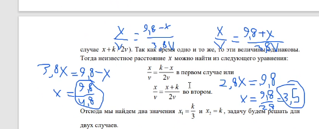
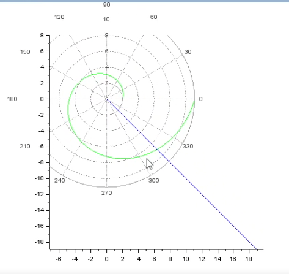
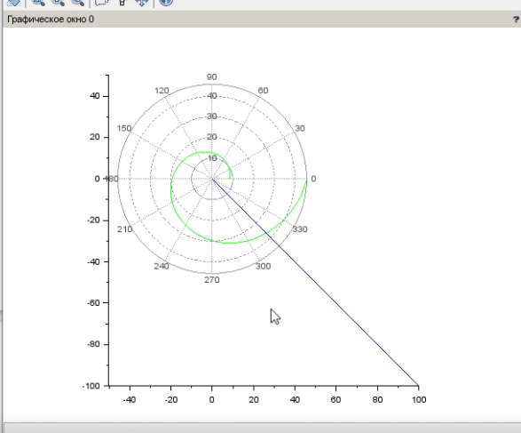
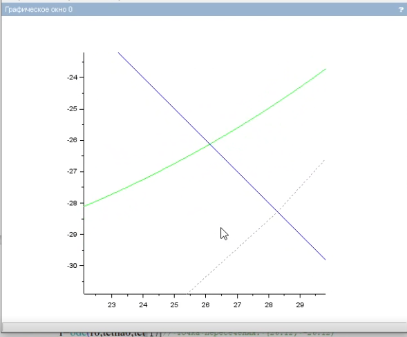

---
# Front matter
title: "Лаб.2 Задача о погоне"
author: "Никулин Максим Геннадьевич"

# Generic otions
lang: ru-RU
toc-title: "Содержание"

# Bibliography
bibliography: bib/cite.bib
csl: pandoc/csl/gost-r-7-0-5-2008-numeric.csl

# Pdf output format
toc: true # Table of contents
toc_depth: 2
lof: true # List of figures
lot: true # List of tables
fontsize: 12pt
linestretch: 1.5
papersize: a4
documentclass: scrreprt
## I18n
polyglossia-lang:
  name: russian
  options:
	- spelling=modern
	- babelshorthands=true
polyglossia-otherlangs:
  name: english
### Fonts
mainfont: PT Serif
romanfont: PT Serif
sansfont: PT Sans
monofont: PT Mono
mainfontoptions: Ligatures=TeX
romanfontoptions: Ligatures=TeX
sansfontoptions: Ligatures=TeX,Scale=MatchLowercase
monofontoptions: Scale=MatchLowercase,Scale=0.9
## Biblatex
biblatex: true
biblio-style: "gost-numeric"
biblatexoptions:
  - parentracker=true
  - backend=biber
  - hyperref=auto
  - language=auto
  - autolang=other*
  - citestyle=gost-numeric
## Misc options
indent: true
header-includes:
  - \linepenalty=10 # the penalty added to the badness of each line within a paragraph (no associated penalty node) Increasing the value makes tex try to have fewer lines in the paragraph.
  - \interlinepenalty=0 # value of the penalty (node) added after each line of a paragraph.
  - \hyphenpenalty=50 # the penalty for line breaking at an automatically inserted hyphen
  - \exhyphenpenalty=50 # the penalty for line breaking at an explicit hyphen
  - \binoppenalty=700 # the penalty for breaking a line at a binary operator
  - \relpenalty=500 # the penalty for breaking a line at a relation
  - \clubpenalty=150 # extra penalty for breaking after first line of a paragraph
  - \widowpenalty=150 # extra penalty for breaking before last line of a paragraph
  - \displaywidowpenalty=50 # extra penalty for breaking before last line before a display math
  - \brokenpenalty=100 # extra penalty for page breaking after a hyphenated line
  - \predisplaypenalty=10000 # penalty for breaking before a display
  - \postdisplaypenalty=0 # penalty for breaking after a display
  - \floatingpenalty = 20000 # penalty for splitting an insertion (can only be split footnote in standard LaTeX)
  - \raggedbottom # or \flushbottom
  - \usepackage{float} # keep figures where there are in the text
  - \floatplacement{figure}{H} # keep figures where there are in the text
---

# Цель работы

Научиться строить математические модели для решения задач.

# Задание

## Вариант 23

На море в тумане катер береговой охраны преследует лодку браконьеров.
Через определенный промежуток времени туман рассеивается, и лодка
обнаруживается на расстоянии 9,8 км от катера. Затем лодка снова скрывается в
тумане и уходит прямолинейно в неизвестном направлении. Известно, что скорость
катера в 3,8 раза больше скорости браконьерской лодки.

1. Запишите уравнение, описывающее движение катера, с начальными
условиями для двух случаев (в зависимости от расположения катера
относительно лодки в начальный момент времени).
2. Постройте траекторию движения катера и лодки для двух случаев.
3. Найдите точку пересечения траектории катера и лодки 

# Теоретическое введение

1. Принимает за t~0~, x~л0~ - место нахождения лодки браконьеров в
момент обнаружения, x~л0~= 9,8 - место нахождения катера береговой охраны
относительно лодки браконьеров в момент обнаружения лодки.
2. Введем полярные координаты. Считаем, что полюс - это точка обнаружения
лодки браконьеров x~л0~ ( $\theta$=x~л0~=0), а полярная ось r проходит 
через точку нахождения катера береговой охраны.
3. Траектория катера должна быть такой, чтобы и катер, и лодка все время
были на одном расстоянии от полюса $\theta$, только в этом случае траектория
катера пересечется с траекторией лодки.
Поэтому для начала катер береговой охраны должен двигаться некоторое
время прямолинейно, пока не окажется на том же расстоянии от полюса, что
и лодка браконьеров. После этого катер береговой охраны должен двигаться
вокруг полюса удаляясь от него с той же скоростью, что и лодка
браконьеров.
4. Чтобы найти расстояние x (расстояние после которого катер начнет
двигаться вокруг полюса), необходимо составить простое уравнение. Пусть
через время t катер и лодка окажутся на одном расстоянии x от полюса. За
это время лодка пройдет x, а катер 9,8-x (или 9,8+x, в зависимости от
начального положения катера относительно полюса). Время, за которое они
пройдут это расстояние, вычисляется как
x/v или k-x/3,8v (во втором случае k-x/3,8v). Так как время одно и то же, то эти величины одинаковы.
Тогда неизвестное расстояние x можно найти из следующего уравнения:
$\frac{x}{v}$=$\frac{9,8-x}{3,8v}$ в первом случае
$\frac{x}{v}$=$\frac{9,8+x}{3,8v}$ во втором.
Отсюда мы найдем два значения x~1~=2 и x~2~=3,5 , задачу будем решать для двух случаев.
5. После того, как катер береговой охраны окажется на одном расстоянии от
полюса, что и лодка, он должен сменить прямолинейную траекторию и
начать двигаться вокруг полюса удаляясь от него со скоростью лодки v.
Для этого скорость катера раскладываем на две составляющие: v~r~ -- радиальная скорость и
v~t~ -- тангенциальная скорость. Радиальная скорость -- это скорость, с которой катер удаляется от полюса,
v~r~=$\frac{dr}{dt}$. Нам нужно, чтобы эта скорость была равна скорости лодки, поэтому полагаем
$\frac{dr}{dt}$=v.
Тангенциальная скорость – это линейная скорость вращения катера
относительно полюса. Она равна произведению угловой скорости
$\frac{d\theta}{dt}$ на радиус r, v~t~=r$\frac{d\theta}{dt}$

6. Решение исходной задачи сводится к решению системы из двух
дифференциальных уравнений 

$\begin{cases}
\frac{dr}{dt}=v\\
r\frac{d\theta}{dt}=\sqrt{13,44}v
\end{cases}$

с начальными условиями 
$\begin{cases}
\theta~0~=0\\
r~0~=2
\end{cases}$
или
$\begin{cases}
\theta~0~=-3,14\\
r~0~=3,5
\end{cases}$

Исключая из полученной системы производную по t, можно перейти к
следующему уравнению:

$\frac{dr}{d\theta}=\frac{r}{\sqrt{13,44}}$

Начальные условия остаются прежними. Решив это уравнение, вы получите
траекторию движения катера в полярных координатах.

# Выполнение лабораторной работы

## Построение траектории движения катера и лодки

Для первого случая (рис. [-@fig:001])

{ #fig:001 width=100% }

Для второго случая (рис. [-@fig:002])

{ #fig:002 width=100% }

## Наождение точек пересечения

Для первого случая (рис. [-@fig:003])

{ #fig:003 width=100% }

###~6,35

Для второго случая (рис. [-@fig:004])

{ #fig:004 width=100% }
###~26,25
## Код программы

{ #fig:005 width=100% }

# Вывод

Научился строить математические модели для решения задач.