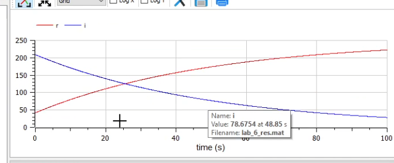
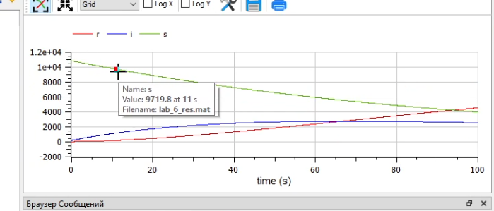
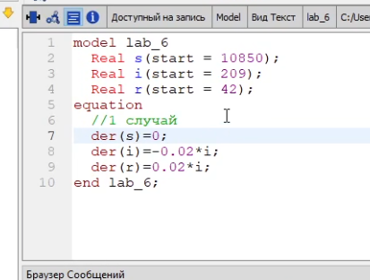

---
# Front matter
title: "Лаб.6 Задача об эпидемии"
author: "Никулин Максим Геннадьевич"

# Generic otions
lang: ru-RU
toc-title: "Содержание"

# Bibliography
bibliography: bib/cite.bib
csl: pandoc/csl/gost-r-7-0-5-2008-numeric.csl

# Pdf output format
toc: true # Table of contents
toc_depth: 2
lof: true # List of figures
lot: true # List of tables
fontsize: 12pt
linestretch: 1.5
papersize: a4
documentclass: scrreprt
## I18n
polyglossia-lang:
  name: russian
  options:
	- spelling=modern
	- babelshorthands=true
polyglossia-otherlangs:
  name: english
### Fonts
mainfont: PT Serif
romanfont: PT Serif
sansfont: PT Sans
monofont: PT Mono
mainfontoptions: Ligatures=TeX
romanfontoptions: Ligatures=TeX
sansfontoptions: Ligatures=TeX,Scale=MatchLowercase
monofontoptions: Scale=MatchLowercase,Scale=0.9
## Biblatex
biblatex: true
biblio-style: "gost-numeric"
biblatexoptions:
  - parentracker=true
  - backend=biber
  - hyperref=auto
  - language=auto
  - autolang=other*
  - citestyle=gost-numeric
## Misc options
indent: true
header-includes:
  - \linepenalty=10 # the penalty added to the badness of each line within a paragraph (no associated penalty node) Increasing the value makes tex try to have fewer lines in the paragraph.
  - \interlinepenalty=0 # value of the penalty (node) added after each line of a paragraph.
  - \hyphenpenalty=50 # the penalty for line breaking at an automatically inserted hyphen
  - \exhyphenpenalty=50 # the penalty for line breaking at an explicit hyphen
  - \binoppenalty=700 # the penalty for breaking a line at a binary operator
  - \relpenalty=500 # the penalty for breaking a line at a relation
  - \clubpenalty=150 # extra penalty for breaking after first line of a paragraph
  - \widowpenalty=150 # extra penalty for breaking before last line of a paragraph
  - \displaywidowpenalty=50 # extra penalty for breaking before last line before a display math
  - \brokenpenalty=100 # extra penalty for page breaking after a hyphenated line
  - \predisplaypenalty=10000 # penalty for breaking before a display
  - \postdisplaypenalty=0 # penalty for breaking after a display
  - \floatingpenalty = 20000 # penalty for splitting an insertion (can only be split footnote in standard LaTeX)
  - \raggedbottom # or \flushbottom
  - \usepackage{float} # keep figures where there are in the text
  - \floatplacement{figure}{H} # keep figures where there are in the text
  - \usepackage[T2A]{fontenc}
---

# Цель работы

Рассмотреть как будет протекать эпидемия в 2ух случаях.

# Задание

## Вариант 23

На одном острове вспыхнула эпидемия. Известно, что из всех проживающих
на острове (N=10850) в момент начала эпидемии (t=0) число заболевших людей
(являющихся распространителями инфекции) I(0)=209, А число здоровых людей с
иммунитетом к болезни R(0)=42. Таким образом, число людей восприимчивых к
болезни, но пока здоровых, в начальный момент времени S(0)=N-I(0)- R(0).
Постройте графики изменения числа особей в каждой из трех групп.

Рассмотрите, как будет протекать эпидемия в случае: 

1. если $I(0)\leq I^*$
2. если $I(0)\geq I^*$

# Теоретическое введение

Рассмотрим простейшую модель эпидемии. Предположим, что некая
популяция, состоящая из N особей, (считаем, что популяция изолирована)
подразделяется на три группы. Первая группа - это восприимчивые к болезни, но
пока здоровые особи, обозначим их через S(t). Вторая группа – это число
инфицированных особей, которые также при этом являются распространителями
инфекции, обозначим их I(t). А третья группа, обозначающаяся через R(t) – это
здоровые особи с иммунитетом к болезни. 

До того, как число заболевших не превышает критического значения $I^*$
, считаем, что все больные изолированы и не заражают здоровых. Когда $I(t)>I^*$,
тогда инфицирование способны заражать восприимчивых к болезни особей. 

Таким образом, скорость изменения числа S(t) меняется по следующему
закону:

$\frac{dS}{dt}=\begin{cases}
-\alpha S, если I(t)>I^*\\
0, если I(t)\leq I^*
\end{cases}$(1)

Поскольку каждая восприимчивая к болезни особь, которая, в конце концов,
заболевает, сама становится инфекционной, то скорость изменения числа
инфекционных особей представляет разность за единицу времени между
заразившимися и теми, кто уже болеет и лечится, т.е.:

$\frac{dI}{dt}=\begin{cases}
-\alpha S-\beta I, если I(t)>I^*\\
-\beta I, если I(t)\leq I^*
\end{cases}$(2)

А скорость изменения выздоравливающих особей (при этом приобретающие
иммунитет к болезни)

$\frac{dR}{dt}=\beta I$(3)

Постоянные пропорциональности $\alpha , \beta$ -- это коэффициенты заболеваемости
и выздоровления соответственно.

Для того, чтобы решения соответствующих уравнений определялось
однозначно, необходимо задать начальные условия .Считаем, что на начало
эпидемии в момент времени t=0 нет особей с иммунитетом к болезни R(0)=0, а
число инфицированных и восприимчивых к болезни особей
I(0) и S(0) соответственно. Для анализа картины протекания эпидемии необходимо
рассмотреть два случая: $I(0)\leq I^*$ и $I(0)> I^*$

# Выполнение лабораторной работы

## Построение графиков

График для 1ого случая (График 1).

График для 2ого случая (График 2).

## Код программы

Код программы для построения графиков (Код 1 и 2).

# Выводы

Рассмотрел как будет протекать эпидемия в 2ух случаях.
