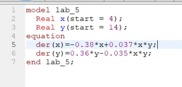
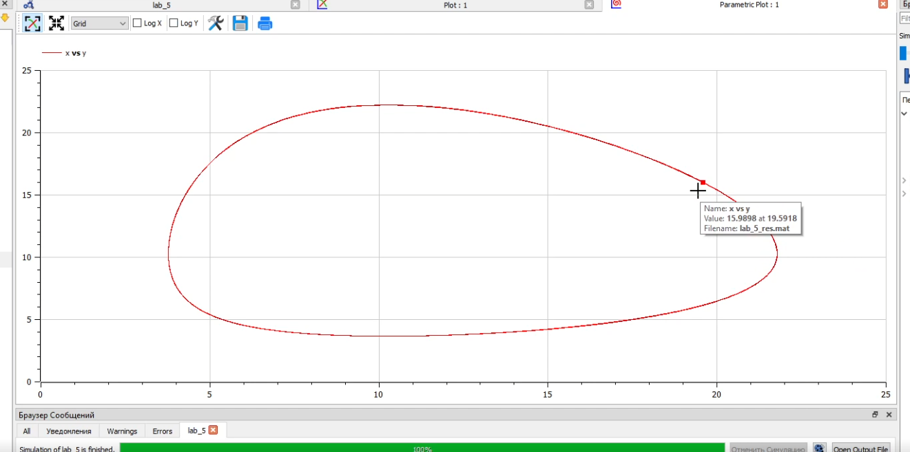
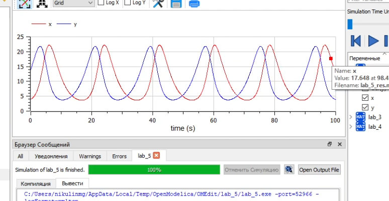

---
## Front matter
lang: en-EN
title: Lab5 Predator and victim
author: Nikulin
institute: RUDN University, Moscow, Russian Federation
date: 2022

## Formatting
toc: false
slide_level: 2
theme: metropolis
header-includes: 
 - '\metroset{progressbar=frametitle,sectionpage=progressbar,numbering=fraction}'
 - '\makeatletter'
 - '\beamer@ignorenonframefalse'
 - '\makeatother'
 - \usepackage[T2A]{fontenc}
aspectratio: 43
section-titles: true
---

# Mission

Models for solving math problems
ASCIILYATOR

# Formulas
{ #fig:005 width=100% }

#a
{ #fig:005 width=30% }

# Code

{ #fig:005 width=100% }

#graph
{ #fig:005 width=100% }
#b
{ #fig:005 width=100% }